# Mini BCR

## Services

- `twitter-crawler` ([README.md](twitter-crawler/README.md))
- `mastodon-crawler` ([README.md](mastodon-crawler/README.md))
- `mentions-matcher` ([README.md](mentions-matcher/README.md))
- `mentions-storage` ([README.md](mentions-storage/README.md))

## Run

```
docker-compose up
```

## Flow



## License

[MIT © Josa Gesell](LICENSE)

